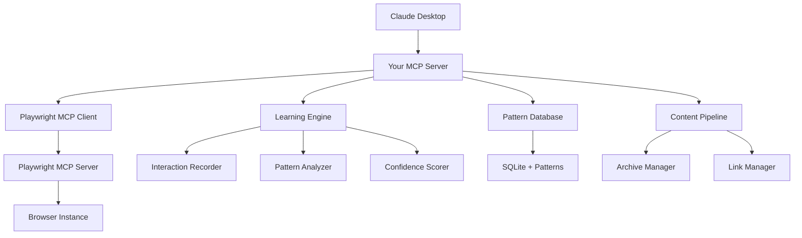

# Browser MCP Server - Product Evolution Roadmap

## 🎯 Vision: Professional-Grade Intelligent Content Discovery

Transform from a custom browser automation tool to a polished, intelligent content discovery platform using Playwright MCP with advanced pattern learning capabilities.

## 📋 Phase 1: Foundation Migration (Week 1-2)

### 1.1 Playwright MCP Integration
- [ ] Replace custom browser automation with Microsoft Playwright MCP
- [ ] Implement MCP client to communicate with Playwright MCP server
- [ ] Refactor all browser operations to use Playwright MCP tools:
  - `browser_navigate` for navigation
  - `browser_click` for interactions
  - `browser_take_screenshot` for visual captures
  - `browser_type` for form filling
- [ ] Update TypeScript types for Playwright MCP integration

### 1.2 Architecture Cleanup
- [ ] Remove custom Playwright dependencies
- [ ] Update package.json to remove direct browser automation
- [ ] Create MCP client service layer
- [ ] Implement proper error handling for MCP communication

## 🧠 Phase 2: Intelligent Learning Mode (Week 2-3)

### 2.1 Pattern Learning Engine
```typescript
interface LearningSession {
  id: string;
  name: string;
  targetSite: string;
  interactions: InteractionCapture[];
  extractedPatterns: ExtractionPattern[];
  status: 'recording' | 'analyzing' | 'completed';
}

interface InteractionCapture {
  timestamp: number;
  action: 'click' | 'type' | 'navigate' | 'scroll';
  element: AccessibilitySnapshot;
  context: PageContext;
  result: ExtractionResult;
}
```

### 2.2 Smart Pattern Recognition
- [ ] Build interaction recorder using Playwright MCP
- [ ] Implement accessibility-first element identification
- [ ] Create pattern analysis engine
- [ ] Develop extraction confidence scoring
- [ ] Build pattern validation system

### 2.3 Learning Mode UI
- [ ] Interactive learning session management
- [ ] Real-time pattern visualization
- [ ] Pattern refinement interface
- [ ] Success/failure feedback system

## 🏗️ Phase 3: Product Polish (Week 3-4)

### 3.1 Professional Configuration Management
```json
{
  "name": "intelligent-content-discovery",
  "version": "1.0.0",
  "description": "AI-powered content discovery with pattern learning",
  "config": {
    "playwright_mcp": {
      "server_url": "http://localhost:3000",
      "browser": "chromium",
      "headless": true
    },
    "learning": {
      "confidence_threshold": 0.8,
      "max_patterns_per_site": 10,
      "auto_validate": true
    }
  }
}
```

### 3.2 Enhanced Error Handling & Logging
- [ ] Structured logging with levels (debug, info, warn, error)
- [ ] Comprehensive error recovery mechanisms
- [ ] Performance monitoring and metrics
- [ ] Health check endpoints

### 3.3 Documentation & Developer Experience
- [ ] Complete API documentation
- [ ] Interactive setup wizard
- [ ] Example configurations and tutorials
- [ ] TypeScript SDK for extensions

## 🚀 Phase 4: Advanced Features (Week 4-5)

### 4.1 Intelligent Content Pipeline
```typescript
interface ContentPipeline {
  source: ContentSource;
  filters: ContentFilter[];
  enrichers: ContentEnricher[];
  outputs: ContentOutput[];
  schedule: CronSchedule;
}
```

### 4.2 Machine Learning Integration
- [ ] Pattern similarity detection
- [ ] Content classification
- [ ] Anomaly detection for broken patterns
- [ ] Automatic pattern evolution

### 4.3 Multi-Site Orchestration
- [ ] Parallel site processing
- [ ] Rate limiting and respectful crawling
- [ ] Site health monitoring
- [ ] Dynamic pattern adaptation

## 📦 Phase 5: Production Readiness (Week 5-6)

### 5.1 Distribution & Packaging
- [ ] Docker containerization
- [ ] npm package publishing
- [ ] Claude Desktop MCP marketplace submission
- [ ] GitHub Actions CI/CD pipeline

### 5.2 Enterprise Features
- [ ] Multi-tenant support
- [ ] API rate limiting
- [ ] Authentication & authorization
- [ ] Usage analytics and monitoring

### 5.3 Community & Ecosystem
- [ ] Plugin architecture for custom extractors
- [ ] Community pattern sharing
- [ ] Integration examples (Discord bots, Slack apps)
- [ ] Contribution guidelines

## 🏛️ New Architecture Overview



## 🎨 User Experience Improvements

### Learning Mode Workflow
1. **Start Learning Session**: `start_learning reddit_frontpage`
2. **Guided Interaction**: User clicks elements they want to extract
3. **Pattern Analysis**: System identifies common selectors and structures
4. **Validation**: Test pattern on similar pages
5. **Production**: Auto-apply learned patterns

### Professional Commands
```bash
# Learning mode
start_learning_session --site reddit.com --name "frontpage_stories"
validate_pattern --pattern-id 123 --test-pages 5
export_patterns --format json --output patterns.json

# Content discovery
discover_content --sites "reddit,hackernews" --keywords "ai,programming"
schedule_crawl --pattern reddit_stories --frequency daily
generate_report --timeframe "last 7 days" --format html
```

## 🛠️ Technical Specifications

### Dependencies
- **Remove**: `playwright` (direct dependency)
- **Add**: MCP client libraries, pattern analysis tools
- **Keep**: Database, archive management, content generation

### Performance Targets
- Pattern learning: < 30 seconds for simple sites
- Content extraction: < 5 seconds per page
- Memory usage: < 500MB for typical workloads
- Startup time: < 3 seconds

### Quality Metrics
- Pattern accuracy: > 95% for learned patterns
- Extraction reliability: > 99% uptime
- False positive rate: < 1%
- User satisfaction: > 4.5/5 stars

## 🎯 Success Criteria

1. **Technical**: Seamless Playwright MCP integration with zero custom browser code
2. **UX**: Learning mode that works for non-technical users
3. **Performance**: 10x faster pattern creation vs manual coding
4. **Adoption**: Ready for Claude Desktop marketplace
5. **Community**: Open source with clear contribution path

This roadmap transforms your project from a custom tool into a professional, intelligent content discovery platform that others can easily use and extend.